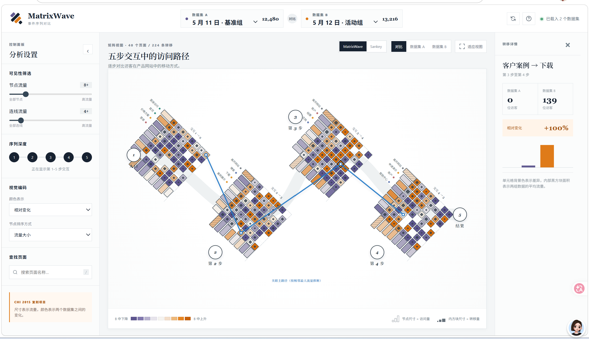

# MatrixWave

**面向事件序列数据的交互式可视化比较系统**

以矩阵化转移视图并排比较两组行为路径，并提供 Sankey 图作为直观参照。

`JavaScript ES Modules` · `SVG` · `零运行依赖` · `中文界面`



> 本项目复现了 Zhao 等人在 CHI 2015 论文 *MatrixWave: Visual Comparison of Event Sequence Data* 中提出的核心视觉设计，并在同一份数据上加入 Sankey 对比视图。项目用于可视化研究、课程展示与交互原型学习，并非论文作者发布的官方实现。

## 项目简介

事件序列记录了用户按时间发生的一连串行为，例如“首页 → 产品 → 客户案例 → 下载”。传统节点连线图在页面和转移数量增加后容易出现大量交叉与遮挡。MatrixWave 将相邻步骤之间的转移组织为一组旋转矩阵，再以波形串联各步骤，让密集关系仍然可以被比较和定位。

这个复刻项目围绕两个问题展开：

- 两组用户在每一步访问了哪些页面，流量有何差异？
- 页面之间的转移如何变化，哪些路径值得进一步检查？

## 核心能力

| 能力 | 说明 |
| --- | --- |
| MatrixWave / Sankey 双视图 | 在矩阵化视图和流向图之间切换，使用相同数据与筛选条件进行公平对比 |
| 数据集 A/B 对比 | 支持合并比较，也可分别查看基准组和活动组 |
| 多层视觉编码 | 同时表达节点流量、转移流量、平均规模及两组数据的相对变化 |
| 交互式探索 | 支持阈值筛选、序列深度、节点排序、页面搜索、缩放和平移 |
| 关联路径追踪 | 点击矩阵单元格后高亮相关转移，并展示一条推断的主路径 |
| 转移详情 | 在右侧面板即时比较选中转移的 A/B 流量、相对变化和柱状图 |
| 完整中文界面 | 页面控件、图例、提示和项目文档均已中文化 |

## 如何阅读 MatrixWave

每一个菱形矩阵代表相邻两个步骤之间的页面转移。矩阵的一侧对应来源页面，另一侧对应目标页面；矩阵单元格则表示具体的一条转移。

| 视觉元素 | 表达含义 |
| --- | --- |
| 矩阵边缘矩形长度 | 页面在该步骤的访问量 |
| 单元格背景色 | 数据集 B 相对数据集 A 的转移流量变化 |
| 单元格内部深色方块 | 两组数据的平均转移流量，面积越大代表流量越高 |
| 紫色 → 浅色 → 橙色 | B 中下降 → 差异较小 → B 中上升 |
| 斜线纹理节点 | 用户离开网站的退出节点 |
| 蓝色连线 | 点击转移后推断出的关联主路径 |


## MatrixWave 与 Sankey 的侧重点

| | MatrixWave | Sankey |
| --- | --- | --- |
| 主要优势 | 密集转移下仍可逐格比较，适合精确定位差异 | 路径方向和整体流量更直观 |
| 关系表达 | 转移矩阵单元格 | 节点间的带状连线 |
| 数据密集时 | 通过矩阵减少连线交叉 | 连线容易重叠和遮挡 |
| 更适合 | 细粒度比较、异常发现、研究分析 | 整体流向理解、快速展示 |

两个视图共享数据集、筛选阈值、排序、搜索、颜色编码、悬停提示和详情面板，可以直接观察同一问题在不同视觉表达下的差别。

## 快速开始

项目不依赖第三方软件包，只需安装 Node.js：

```bash
git clone https://github.com/venti-klee/MatrixWave.git
cd MatrixWave
npm run dev
```

浏览器访问 [http://127.0.0.1:4173](http://127.0.0.1:4173) 即可体验。

生成生产版本：

```bash
npm run build
```

构建结果会输出到 `dist/`。可使用 `npm run preview` 预览构建版本。

## 项目结构

```text
MatrixWave/
├── index.html          # 页面结构与中文界面
├── styles.css          # 布局、组件和可视化样式
├── app.js              # 数据聚合、SVG 绘制与交互逻辑
├── server.mjs          # 零依赖本地静态服务器
├── build.mjs           # 生产构建脚本
├── docs/images/        # README 展示图片
└── package.json        # 项目命令与元信息
```

## 数据与复现边界

- 当前点击流为确定性生成的合成示例数据，用于演示和测试，不是论文中的 Adobe.com 私有数据。
- 演示数据保存的是聚合转移量，而非原始用户轨迹。因此蓝色关联路径根据相邻步骤中的最大流量推断；论文原系统可利用原始事件序列计算精确的路径专属流量。
- 本项目重点复现论文的核心布局、视觉编码和交互思路，并加入中文界面与 Sankey 对比，不追求对原系统每个实现细节的一比一还原。

## 后续方向

- 支持导入 CSV / JSON 事件序列
- 基于原始轨迹计算精确的路径专属流量
- 增加更多数据集和时间窗口的对比
- 提供筛选结果导出与可复现分析快照
- 补充自动化视觉回归与无障碍支持

## 论文参考

Jian Zhao, Zhicheng Liu, Mira Dontcheva, Aaron Hertzmann, and Alan Wilson. 2015. *MatrixWave: Visual Comparison of Event Sequence Data*. Proceedings of CHI 2015, 259–268.

- [论文 DOI：10.1145/2702123.2702419](https://doi.org/10.1145/2702123.2702419)
- [ResearchGate 页面](https://www.researchgate.net/publication/281455039_MatrixWave_Visual_Comparison_of_Event_Sequence_Data)

如果这个项目对你的事件序列可视化学习有所帮助，欢迎通过 Issue 分享数据场景、交互建议或复现问题。
